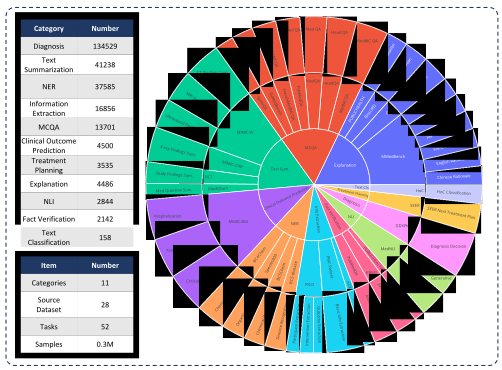
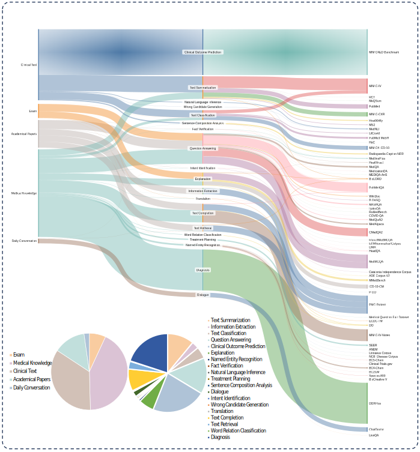

# MedS-Ins
The official codes for "Towards Evaluating and Building Versatile Large Language Models for Medicine"

[Paper](https://arxiv.org/abs/2408.12547)

[Leaderboard](https://henrychur.github.io/MedS-Bench/)

Datasets: [MedS-Ins](https://huggingface.co/datasets/Henrychur/MedS-Ins), [MedS-Bench](https://huggingface.co/datasets/Henrychur/MedS-Bench)

Models: [MMedS-Llama3-8B](https://huggingface.co/Henrychur/MMedS-Llama-3-8B)

:construction: **_This Repo is updating now, coming soon!_** :construction:

---

## Introduction

In this study, we introduce **MedS-Bench**, a comprehensive benchmark designed to evaluate the performance of large language models (LLMs) in clinical contexts. Unlike traditional benchmarks that focus solely on multiple-choice question answering, **MedS-Bench** covers 11 critical clinical tasks, including clinical report summarization, treatment recommendations, diagnosis, named entity recognition, and medical concept explanation, among others. We evaluated six leading LLMs, such as MEDITRON, Mistral, InternLM 2, Llama 3, GPT-4, and Claude-3.5, using few-shot prompting. Our findings reveal that even the most advanced models face significant challenges in these complex tasks.

To overcome these limitations, we developed **MedS-Ins**, a large-scale instruction tuning dataset tailored for medicine. **MedS-Ins** comprises 58 medically oriented language corpora, totaling 5M Instances with 19K Instructions *(Notably, In version 1 paper, we counted different combinations of instructions and instances as a different sample, so we counted 13.5M samples, but now we have expanded the number of our instructions and counted them separately, reuslting in different totaling numbers.)* samples across 122 tasks. To demonstrate the dataset's utility, we conducted a proof-of-concept experiment by performing instruction tuning on a lightweight, open-source medical language model. The resulting model, **MMedIns-Llama 3**, significantly outperformed existing models across nearly all clinical tasks.

To foster further advancements in applying LLMs to clinical challenges, we have made the **MedS-Ins** dataset fully accessible and invite the research community to contribute to its expansion. Additionally, we have launched a dynamic leaderboard for **MedS-Bench**, with plans to regularly update the test set to track progress and improve the adaptation of general LLMs to the medical domain.

---

## News

[2024.8.23] Our pre-print paper is released ArXiv. Dive into our findings [here](https://arxiv.org/abs/2408.12547).

---

## Data
### Data Format
For each task we need a json file like following:
```
{
  "Contributors": [""],
  "Source": [""],
  "URL": [""],
  "Categories": [""],
  "Reasoning": [""],
  "Definition": [""],
  "Input_language": [""], 
  "Output_language": [""],
  "Instruction_language": [""],  
  "Domains": [""],    
  "Positive Examples": [ { "input": "", "output": "",  "explanation": ""} ], 
  "Negative Examples": [ { "input": "", "output": "",  "explanation": ""} ],
  "Instances": [ { "id": "", "input": "", "output": [""]} ],
}
```

```
Contributors: your name;
Source: dataset name;
URL: data sources;
Categories: high level NLP task categories like QA,summarization;
Reasonging: some sentences to clarify the reasoning chain for the task, like "The problem will give you four options, you should pick one based on the analysisi of the question blabla..." (Can be blank);
Definition: detail definition for the task;
Input_language: English or Chinese or something else for context input;
Output_language: English or Chinese or something else for answering;
Instruction_language:  English or Chinese or something else for instruction;
Domains: Clarify which medical sub-domain the task involves with, like drug, diagnosis, or content types, like academical papers, daily conversation, exam, and so on;
Positive Examples: All typical example cases;
Negative Examples: All typical fail cases, explanation is neccessary per case while this item can be totally blank;
Instances: main instances;
```

**We strongly acknowledge any volunteer to contribute data into our dataset. You can check the DATA_Contributor directory to see how to contribute data and we will thank each participant in writing in next updating of our paper!**
### MedS-Bench Description
To evaluate the capabilities of various LLMs in clinical applications, we developed MedS-Bench, a comprehensive medical benchmark that extends beyond traditional multiple-choice questions. MedS-Bench encompasses 11 high-level clinical task categories, derived from 39 existing datasets.

<p align="center">
  
</p>

### MedS-Ins Description
To enhance the fine-tuning of LLMs for various downstream clinical tasks, we introduce MedS-Ins, a carefully curated dataset designed to encompass a wide range of medical language processing tasks. This dataset is compiled from five distinct text sources, spanning 19 task categories and 122 unique clinical tasks.

<p align="center">
  
</p>


## Citation
```
@misc{wu2024evaluatingbuildingversatilelarge,
      title={Towards Evaluating and Building Versatile Large Language Models for Medicine}, 
      author={Chaoyi Wu and Pengcheng Qiu and Jinxin Liu and Hongfei Gu and Na Li and Ya Zhang and Yanfeng Wang and Weidi Xie},
      year={2024},
      eprint={2408.12547},
      archivePrefix={arXiv},
      primaryClass={cs.CL},
      url={https://arxiv.org/abs/2408.12547}, 
}
```
